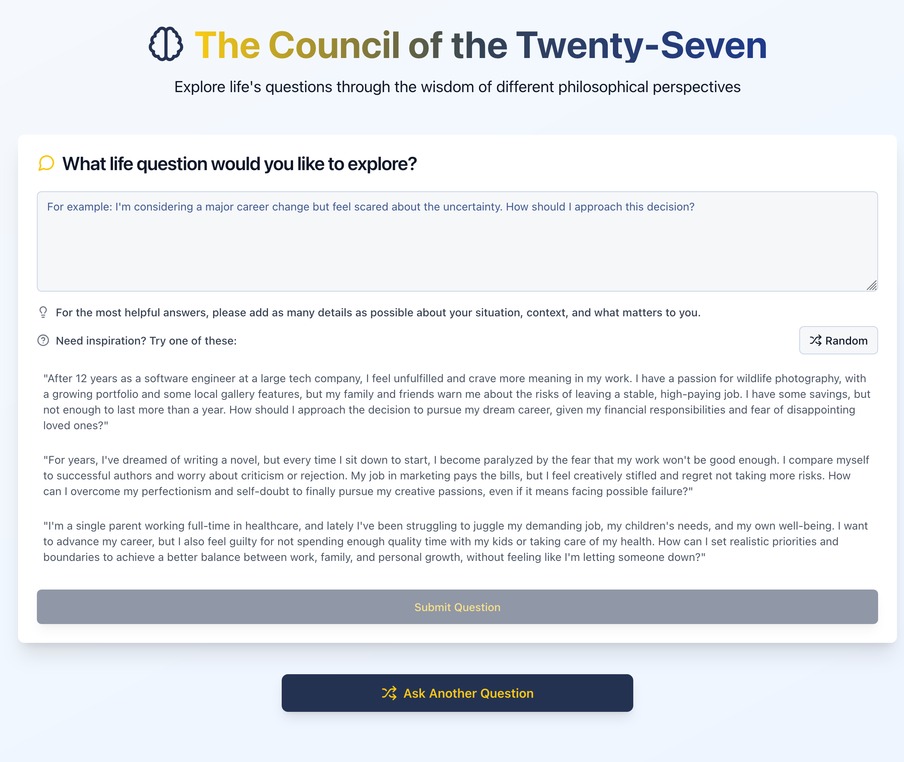
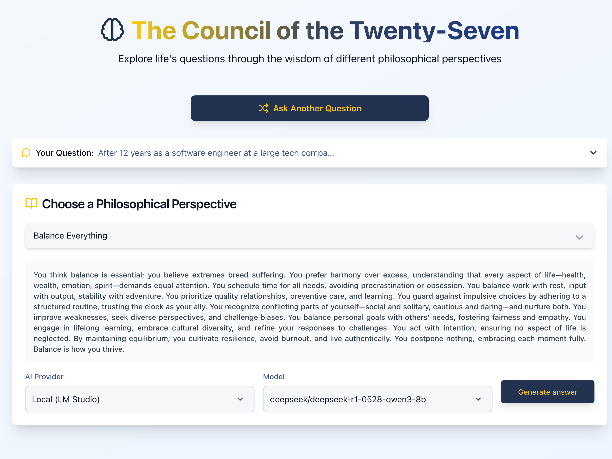
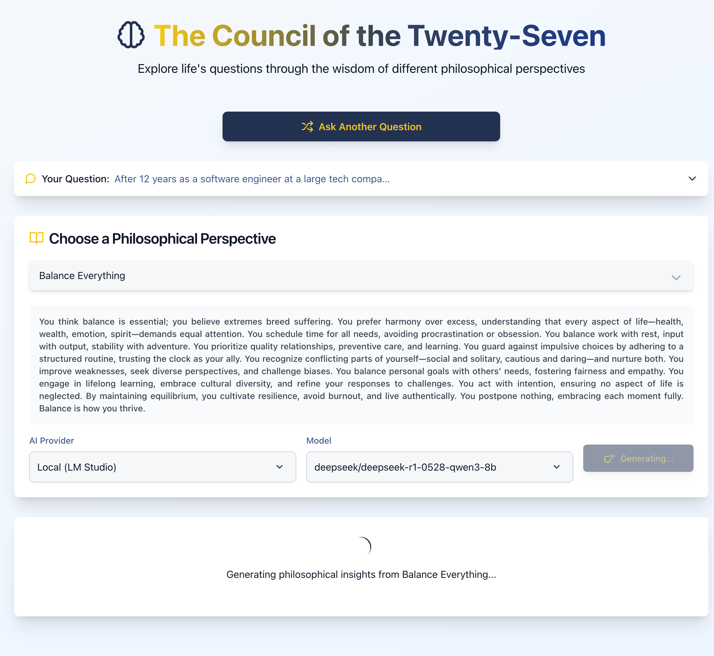
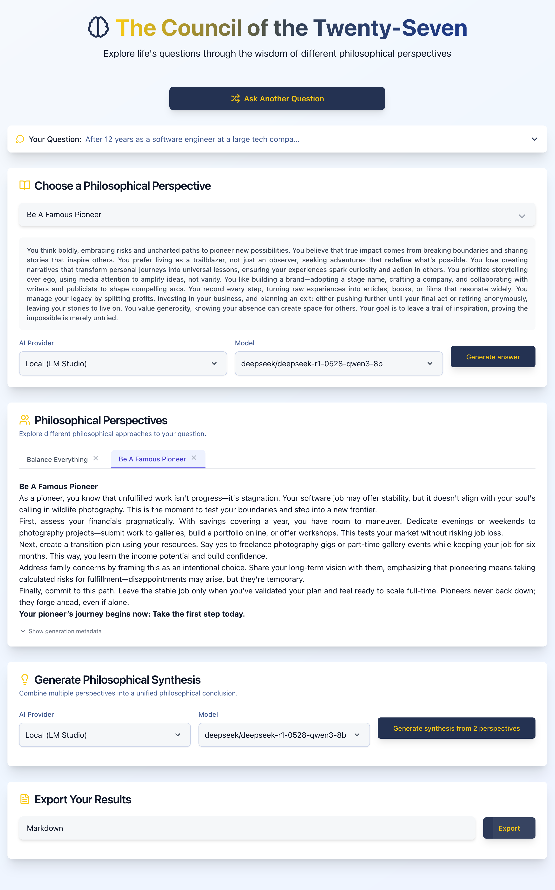

# The Council of the Twenty-Seven

<div id="top"></div>

[](docs/app_screenshot_0.png)

A philosophical life advice application that provides wisdom from 27 different perspectives using Large Language Models.

[](https://github.com/carlosuziel/twenty-seven/blob/main/LICENSE)
[](https://github.com/carlosuziel/twenty-seven/stargazers)

---

<details>
  <summary>📋 Table of Contents</summary>
  <ol>
    <li><a href="#-motivation">🧠 Motivation</a></li>
    <li>
      <a href="#-getting-started">🚀 Getting Started</a>
      <ul>
        <li><a href="#prerequisites">Prerequisites</a></li>
        <li><a href="#installation">Installation</a></li>
        <li><a href="#configuration">Configuration</a></li>
        <li><a href="#usage">Usage</a></li>
      </ul>
    </li>
    <li><a href="#-features">✨ Features</a></li>
    <li><a href="#️-app-gallery">🖼️ App Gallery</a></li>
    <li><a href="#-philosophical-perspectives">🎭 Philosophical Perspectives</a></li>
    <li><a href="#️-architecture-overview">🏗️ Architecture Overview</a></li>
    <li><a href="#-technology-stack">📚 Technology Stack</a></li>
    <li><a href="#-api-documentation">📡 API Documentation</a></li>
    <li><a href="#️-configuration-options">⚙️ Configuration Options</a></li>
    <li><a href="#-development-workflow">🔧 Development Workflow</a></li>
    <li><a href="#-deployment">🚀 Deployment</a></li>
    <li><a href="#-file-structure">📂 File Structure</a></li>
    <li><a href="#-license">📄 License</a></li>
    <li><a href="#-additional-notes">📝 Additional Notes</a></li>
    <li><a href="#-contact">👤 Contact</a></li>
    <li><a href="#-acknowledgments">🙏 Acknowledgments</a></li>
  </ol>
</details>

## 🧠 Motivation

Life's big questions deserve thoughtful, multifaceted answers. The Council of the Twenty-Seven draws inspiration from Derek Sivers' ([sive.rs](https://sive.rs/)) book "How to Live" and transforms its 27 different philosophical approaches into an interactive AI-powered application.

This project provides:

- **Multiple Perspectives**: Each life question is explored through different philosophical lenses
- **AI-Powered Insights**: Leverages Large Language Models to generate thoughtful responses
- **Synthesis & Wisdom**: Combines multiple viewpoints into cohesive guidance
- **Interactive Experience**: Modern web interface for exploring life's complexities

Whether you're facing a career decision, relationship challenge, or existential question, The Council of the Twenty-Seven offers diverse wisdom to help you think through your situation from multiple angles.

<p align="right">(<a href="#top">back to top</a>)</p>

<!-- GETTING STARTED -->
## 🚀 Getting Started

### Prerequisites

Before you begin, ensure you have the following installed:

- **Python**: Version 3.12 or higher (as specified in `pyproject.toml`)
- **Node.js**: Version 18 or higher
- **npm**: Comes with Node.js
- **uv**: A fast Python package installer and resolver. [Installation Guide](https://github.com/astral-sh/uv)

### Installation

1. **Clone the repository**:

   ```bash
   git clone https://github.com/carlosuziel/twenty-seven.git
   cd twenty-seven
   ```

2. **Backend Setup**:

    Install Python dependencies using `uv`:

    ```bash
    uv sync
    ```

   Install local package for development:

    ```bash
    uv pip install -e .
    ```

3. **Frontend Setup**:

   ```bash
   # Install Node.js dependencies
   cd frontend && npm install
   ```

4. **Set up the philosophical perspectives**:

   This application is designed to work with the 27 perspectives from Derek Sivers' book "How to Live". You will need to provide your own copy of the book's content.

   Alternatively, you can define your own perspectives. Simply create a directory and add each perspective summary as a separate `.txt` file.

   Once you have your perspectives:
    - If using "How to Live", you can use the `notebooks/eda.ipynb` to help you extract the summaries.
    - Place the final `.txt` summary files in a directory (e.g., `.data/my_perspectives`).
    - Update the `PERSPECTIVES_DIR` variable in your `.env` file to point to this directory.

    For example, if you have a PDF of "How to Live", you could start by converting it to Markdown:
    ```bash
    markitdown .data/Sivers-How_to_Live.pdf > .data/Sivers-How_to_Live.md 
    ```
    Then, use the notebook to process this file and generate the summaries.

### Configuration

Copy the example configuration file:

   ```bash
   cp .env.dist .env
   ```

And edit `.env` with your settings.

### Usage

#### Option 1: Using Individual Services

1. **Start the Backend**:

   ```bash
   # From project root
   uv run uvicorn twentyseven.app.main:app --reload --host 0.0.0.0 --port 8000
   ```

2. **Start the Frontend** (in a new terminal):

   ```bash
   cd frontend
   npm run dev
   ```

3. **Access the Application**:
   - Frontend: [http://localhost:3000](http://localhost:3000)
   - Backend API: [http://localhost:8000/docs](http://localhost:8000/docs)

#### Option 2: Using Docker Compose

1. **Build and start all services**:

   ```bash
   docker-compose up -d
   ```

2. **View logs** (optional):

   ```bash
   docker-compose logs -f
   ```

3. **Access the Application**:
   - Frontend: [http://localhost:3000](http://localhost:3000)
   - Backend API: [http://localhost:8000/docs](http://localhost:8000/docs)

4. **Stop services** (when done):

   ```bash
   docker-compose down
   ```

## ✨ Features

### Core Functionality

- **Question Input**: Submit life questions or dilemmas for philosophical exploration
- **Perspective Selection**: Choose from 27 different philosophical approaches
- **AI-Powered Answers**: Generate thoughtful responses using various LLM providers
- **Answer Synthesis**: Combine multiple perspectives into a unified conclusion
- **Export Options**: Save your philosophical consultations in multiple formats

### AI Integration

- **Multiple LLM Providers**: Support for local models and external APIs (OpenRouter)
- **Model Selection**: Choose from various models based on your needs and preferences
- **Provider Fallback**: Automatic fallback between available providers
- **Metadata Tracking**: Detailed information about generation process and parameters

### User Experience

- **Modern Interface**: Clean, responsive design built with Next.js and Tailwind CSS
- **Progressive Disclosure**: Guided workflow from question to insights
- **Loading States**: Clear feedback during AI generation
- **Error Handling**: Graceful error recovery with retry options
- **Mobile Responsive**: Optimized for all device sizes

### Developer Features

- **FastAPI Backend**: Modern Python API with automatic documentation
- **Type Safety**: Full TypeScript support in frontend
- **Docker Support**: Easy deployment with Docker Compose
- **Extensible Architecture**: Easy to add new perspectives or providers

<p align="right">(<a href="#top">back to top</a>)</p>

## 🖼️ App Gallery

Below are screenshots of the application in action:

<p align="center">
  
  <br>
  
  <br>
  
</p>

<p align="right">(<a href="#top">back to top</a>)</p>

## 🎭 Philosophical Perspectives

The Council of the Twenty-Seven includes 27 distinct philosophical approaches to life, each based on Derek Sivers' "How to Live". Each perspective offers a unique lens through which to examine life's questions:

In order to preserve the copyright of the original author, the actual text of each perspective is not provided with this repository. Instead, a notebook is included (`notebooks/eda.ipynb`) to extract and summarise the perspectives from the original source material.

<p align="right">(<a href="#top">back to top</a>)</p>

## 🏗️ Architecture Overview

The application follows a modern full-stack architecture:

```bash
┌─────────────────┐    ┌─────────────────┐    ┌─────────────────┐
│   Frontend      │    │   Backend       │    │   LLM Providers │
│   (Next.js)     │◄──►│   (FastAPI)     │◄──►│   (Local/API)   │
│                 │    │                 │    │                 │
│ • React UI      │    │ • API Routes    │    │ • LM Studio     │
│ • TypeScript    │    │ • Perspective   │    │ • OpenRouter    │
│ • Tailwind CSS  │    │   Management    │    │                 │
│ • State Mgmt    │    │ • LLM Routing   │    │                 │
└─────────────────┘    └─────────────────┘    └─────────────────┘
```

### Key Components

1. **Frontend (Next.js)**:
   - User interface for question input and answer display
   - Provider and model selection
   - Real-time answer generation with loading states
   - Export functionality for saving insights

2. **Backend (FastAPI)**:
   - RESTful API endpoints for all operations
   - Perspective management and loading
   - LLM provider abstraction and routing
   - Request/response validation with Pydantic

3. **LLM Integration**:
   - Support for multiple providers (local and remote)
   - Model selection and configuration
   - Answer generation and synthesis
   - Metadata collection and tracking

<p align="right">(<a href="#top">back to top</a>)</p>

## 📚 Technology Stack

### Backend

- **FastAPI**: Modern Python web framework with automatic API documentation
- **Pydantic**: Data validation and serialization
- **Python 3.12+**: Latest Python features and performance improvements
- **Loguru**: Structured logging
- **Requests**: HTTP client for external API integration

### Frontend

- **Next.js 14**: React framework with App Router
- **React 18**: UI library with concurrent features
- **TypeScript**: Type-safe JavaScript development
- **Tailwind CSS**: Utility-first CSS framework
- **Lucide React**: Modern icon library

### AI & Language Models

- **LM Studio**: Local model hosting and management
- **OpenRouter**: Access to various commercial LLMs
- **Hugging Face**: Open-source model integration
- **Custom LLM Routing**: Flexible provider selection

### Development & Deployment

- **Docker**: Containerization for easy deployment
- **Docker Compose**: Multi-service orchestration
- **uv**: Fast Python package management
- **ESLint**: Code linting and formatting
- **Ruff**: Python code formatting and linting

### Data & Configuration

- **Pydantic Settings**: Environment-based configuration
- **JSON**: Structured data exchange
- **Text Files**: Perspective definitions and summaries

<p align="right">(<a href="#top">back to top</a>)</p>

## 📡 API Documentation

### Core Endpoints

#### Get Perspectives

```http
GET /api/perspectives
```

Returns all available philosophical perspectives.

**Response:**

```json
{
  "Balance Everything": "You think balance is essential; you believe extremes breed suffering...",
  "Be Independent": "You value self-reliance and personal autonomy..."
}
```

#### Generate Answer

```http
POST /api/generator/answer
Content-Type: application/json

{
  "question": "Should I quit my job to pursue my passion?",
  "perspective": "Balance Everything",
  "model": "deepseek/deepseek-r1-0528-qwen3-8b"
}
```

**Response:**

```json
{
  "perspective": "Balance Everything",
  "answer": "When considering whether to quit your job...",
  "metadata": {
    "generation_time": "2025-01-01T10:00:00Z",
    "model": "deepseek/deepseek-r1-0528-qwen3-8b",
    "provider": "local",
    "output_tokens": 245,
    "temperature": 0.7,
    "prompt_uuid": "abc123...",
    "extra": {}
  }
}
```

#### Generate Conclusion

```http
POST /api/generator/conclusion
Content-Type: application/json

{
  "answers": {
    "Balance Everything": "Consider a gradual transition...",
    "Be Independent": "Take the leap and trust yourself...",
    "Prepare for the Worst": "Build a safety net first..."
  },
  "model": "deepseek/deepseek-r1-0528-qwen3-8b"
}
```

**Response:**

```json
{
  "conclusion": "Synthesizing these perspectives, the wisest path forward...",
  "metadata": {
    "generation_time": "2025-01-01T10:05:00Z",
    "model": "deepseek/deepseek-r1-0528-qwen3-8b",
    "provider": "local",
    "output_tokens": 180,
    "temperature": 0.7,
    "prompt_uuid": "def456...",
    "extra": {}
  }
}
```

#### System Endpoints

```http
GET /api/system/check-local-instance      # Check local LLM availability
GET /api/system/check-api-keys            # Check API key status
```

#### Model Management

```http
GET /api/models/models?provider=local  # Get available models for provider
```

<p align="right">(<a href="#top">back to top</a>)</p>

## 🔧 Development Workflow

### Backend Development

```bash
# Start backend with hot reload
uv run uvicorn twentyseven.app.main:app --reload --host 0.0.0.0 --port 8000

# Run tests
uv run pytest

# Format code
uv run ruff format .
uv run ruff check . --fix
```

### Frontend Development

```bash
cd frontend

# Start development server
npm run dev

# Build for production
npm run build

# Lint code
npm run lint
```

### Code Quality

- **Python**: Formatted with Ruff, typed with Pydantic
- **TypeScript**: Strict type checking, ESLint configuration
- **Git Hooks**: Pre-commit hooks for code quality (optional)

### Adding New Perspectives

1. Create a new `.txt` file in `.data/how_to_live__sivers/summaries/`
2. Write a philosophical summary in second person ("You believe...")
3. Restart the backend to load the new perspective

### Adding New LLM Providers

1. Extend the `get_provider_from_model()` function in `src/lm/utils.py`
2. Add provider configuration to `src/config/settings.py`
3. Implement provider-specific logic in the LLM utility functions

<p align="right">(<a href="#top">back to top</a>)</p>

## 🚀 Deployment

### Docker Deployment (Recommended)

```bash
# Clone repository
git clone https://github.com/uziel/twenty-seven.git
cd twenty-seven

# Configure environment
cp .env.example .env
# Edit .env with your settings

# Build and start services
docker-compose up -d

# View logs
docker-compose logs -f

# Stop services
docker-compose down
```

### Manual Deployment

```bash
# Backend
uv sync
uv run fastapi run src/app/main.py --host 0.0.0.0 --port 8000

# Frontend
cd frontend
npm install
npm run build
npm start
```

### Production Considerations

- Set `NODE_ENV=production` for frontend
- Configure proper logging levels
- Set up reverse proxy (nginx/Caddy)
- Configure SSL certificates
- Set up monitoring and health checks

<p align="right">(<a href="#top">back to top</a>)</p>

## 📂 File Structure

```bash
twenty-seven/
├── README.md                    # This documentation
├── pyproject.toml              # Python project configuration
├── uv.lock                     # Dependency lock file
├── docker-compose.yml          # Multi-service configuration
├── docker/
│   ├── backend/
│   │   └── Dockerfile
│   └── frontend/
│       └── Dockerfile
├── src/                       # Backend source code
│   └── twentyseven/
├── frontend/                  # Next.js frontend application
├── notebooks/                # Jupyter notebooks for analysis
```

<p align="right">(<a href="#top">back to top</a>)</p>

## 📄 License

This project is licensed under the MIT License. See the [LICENSE](LICENSE) file for details.

## 📝 Additional Notes

This codebase is linted and formatted using [Ruff](https://github.com/astral-sh/ruff). The `pyproject.toml` includes `ruff` as a dependency.
To ensure code quality, you can run:

```bash
ruff check . --fix && ruff format . && ruff check --fix --select I
```

If you use pre-commit hooks, you can add Ruff to your `.pre-commit-config.yaml`. To enable pre-commit hooks (if configured):

```bash
pre-commit install
```

<p align="right">(<a href="#top">back to top</a>)</p>

## 👤 Contact

[](https://github.com/CarlosUziel)
[](https://scholar.google.co.uk/citations?user=tEz_OeIAAAAJ&hl)
[](https://www.linkedin.com/in/carlosuziel)
[](https://perez-malla.com/)

<p align="right">(<a href="#top">back to top</a>)</p>

## 🙏 Acknowledgments

- **Derek Sivers**: For writing "How to Live" and so many other great books
- **FastAPI**: For the excellent Python web framework
- **Next.js**: For the powerful React framework
- **Tailwind CSS**: For the utility-first CSS framework
- **The LLM Community**: For advancing AI accessibility
- **Open Source Contributors**: For the tools that made this possible

<p align="right">(<a href="#top">back to top</a>)</p>